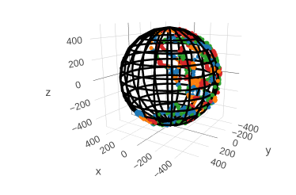

# Magnetometer Calibration In Rust

We offer offline (batch) and online (streamed) calibration for magnetometer. See [offline](tests/offline.rs) and [online](tests/online.rs) as examples.

Why use this package?</br>
* rust/c/cpp/java support
* normalization of points to prevent large values in scatter matrix.
* downsampling to compute post calibration spherical coverage, and prevent oversampling of a specific areas
* field tested


 To build the wrappers for forigen langauges use `cargo make cpp_wrapper` or `cargo make java_wrapper`.

For android you will need to define links in `.cargo/config.toml`:
```
[target.aarch64-linux-android]
linker = "path to aarch64-linux-androidXX-clang++"

[target.armv7-linux-androideabi]
linker = path to armv7a-linux-androideabiXX-clang++
```
After, compile with `cargo make java_wrapper --target aarch64-linux-android`

<p align="center">
  
</p>

## Sources:
Li, Qingde & Griffiths, Gareth. (2004). Least squares ellipsoid specific fitting. Proceedings - Geometric Modeling and Processing 2004. 2004. 335- 340. 10.1109/GMAP.2004.1290055. 

https://teslabs.com/articles/magnetometer-calibration/
